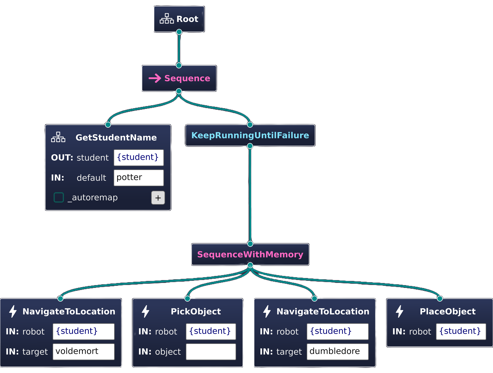

# About Behavior Trees

The [behavior tree paradigm](https://arxiv.org/abs/1709.00084) is commonly used in robotics for modeling transitions between different skills, actions or tasks (those terms are often used interchangeably). Behavior trees offer a flexible syntax for defining how to achieve a specific goal. Therefore, they are perfectly suited for creating robotic behaviors as well as for task planning. We adopt the C++ implementation offered by [BehaviorTree.CPP](https://www.behaviortree.dev/).

Generally speaking, behavior trees are composed of nodes (not ROS 2 nodes, but behavior tree specific nodes) that are assembled relative to each other's position. They are considered the building blocks of a behavior tree. Various different types of nodes have been defined by different research. We stick to the following definition:

Node Type | Number of Children | Description
--- | :---: | ---
**Control** | At least 1 | Passes the tick to its children based on certain rules and takes each child's result **status** into account.
**Decorator** | Exactly 1 | Executes a certain function before or after passing the tick to its child.
**Condition** | Exactly 0 | Used for determining if a certain condition is met or not.
**Action** | Exactly 0 | Performs work in an synchronous or asynchronous manner.

As you can see, **Control** and **Decorator** nodes are allowed to have nodes as children, so there is a parent-child relation. This property makes behavior trees hierarchically structured.

When we speak of "ticking" a behavior tree node, it means that we invoke the tick callback that is implemented by each node. By convention, the behavior tree propagates the tick from top to bottom and left to right and the invoked function always returns one of the following statuses:

Status | Meaning
--- | ---
**SUCCESS** or **FAILURE** | The node finished executing and the job either succeeded or failed.
**RUNNING** | The node needs more time to determine the final result. This enables asynchronous execution.
**SKIPPED** | Special status for indicating that the parent node should not tick this node and proceed to the next one.

With these definitions you are able to create complex task plans. For example the behavior tree from the [installation example](../introduction/getting-started.md#launch-an-example) looks like this:



It can also be represented using a specific [XML schema](https://www.behaviortree.dev/docs/learn-the-basics/xml_format) designed for storing exactly this information in a machine readable format. Most importantly, this makes behavior tree configurations **serializable**. Here is the XML for the tree above:

```xml
<root BTCPP_format="4"
      main_tree_to_execute="GryffindorTree">

  <BehaviorTree ID="GetStudentName">
    <Fallback>
      <Sequence>
        <HasParameter parameter="bb.student"
                      node=""/>
        <GetParameterString parameter="bb.student"
                            value="{student}"
                            node=""/>
      </Sequence>
      <Script code="student := default"/>
    </Fallback>
  </BehaviorTree>

  <BehaviorTree ID="GryffindorTree">
    <Sequence>
      <SubTree ID="GetStudentName"
               student="{student}"
               default="potter"/>
      <KeepRunningUntilFailure>
        <SequenceWithMemory>
          <NavigateToLocation robot="{student}"
                              target="voldemort"/>
          <PickObject robot="{student}"
                      object=" "/>
          <NavigateToLocation robot="{student}"
                              target="dumbledore"/>
          <PlaceObject robot="{student}"/>
        </SequenceWithMemory>
      </KeepRunningUntilFailure>
    </Sequence>
  </BehaviorTree>

</root>
```

Now that you know what we mean when talking about behavior trees, visit the tutorial [Building Behavior Trees](../tutorial/building-behavior-trees.md) for getting started with creating them yourself.
