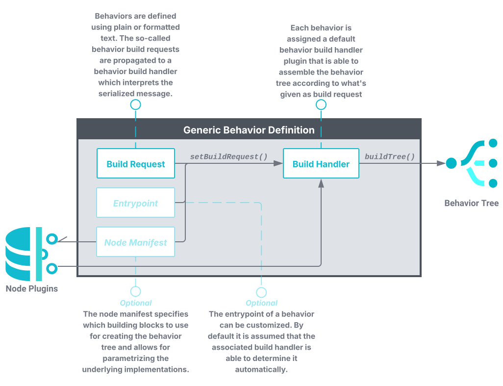
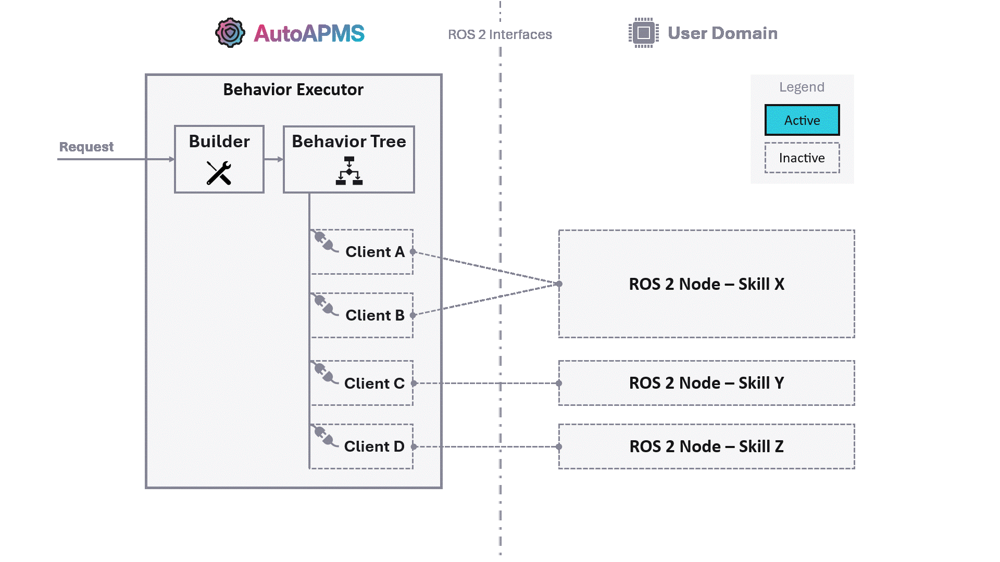

# Fundamentals

Before starting with the tutorials you should make yourself familiar with the fundamental concepts. This page outlines the most important definitions and design decisions you need to know about.

## Understanding Behaviors

In robotics, the term *behavior* refers to the pattern of actions or responses carried out by an automated system to achieve a specific goal. Behaviors can be very simple (like avoiding obstacles) or complex (like following a person or coordinating with other robots). A popular paradigm widely used for designing such plans of action is the [behavior tree](./behavior-trees.md). Behavior trees are hierarchical structures that allow users to intuitively define missions by arranging simple building blocks and create arbitrarily complex applications using model-based programming. AutoAPMS adopts this paradigm and makes it a first class citizen for modeling behaviors.

For communicating behaviors with robots, we introduce a rather abstract but flexible pipeline. The intention behind this is to give developers the opportunity to design specialized behavior definition schemas that best suit their needs. In other words, **AutoAPMS allows for customizing the behavior tree build workflow** that is triggered by the user when launching a behavior. We define a behavior using

1. A behavior **build request** that holds the information about the action plan designed for a specific use-case (according to a user-defined schema)

1. A behavior **build handler** that knows the schema the build request is encoded in and builds the behavior tree accordingly

1. *Optional:* An **entrypoint** that specifies the root of the behavior tree

1. *Optional:* A **node manifest** that maps the behavior's building blocks with the correct plugins

The standard way of defining behaviors is using an [XML schema](https://www.behaviortree.dev/docs/learn-the-basics/xml_format) that explicitly states the relation between each individual behavior tree node. In this case, the corresponding build handler can directly create the tree by parsing the build request (formatted XML string) using the [`TreeDocument`](https://autoapms.github.io/auto-apms/classauto__apms__behavior__tree_1_1core_1_1TreeDocument.html) class that encapsulates the C++ behavior tree building functionality. This workflow can be adopted by using one of the [commonly used behavior build handlers](./common-resources.md#behavior-build-handlers) that are available out of the box. If you would like to introduce custom behavior tree building algorithms, you can [implement your own build handlers](../tutorial/building-behavior-trees.md#using-treebuildhandler).

The combination of a build request, a build handler and optionally an entrypoint and a node manifest is considered a single behavior. Altogether, they uniquely define the pattern of actions for a robotic system. Typically, they should be installed as resources in your ROS 2 workspace using the CMake macro [`auto_apms_behavior_tree_register_behavior`](../reference/cmake.md#register-behavior). All registered behaviors can be conveniently managed using the [`ros2behavior` CLI](../reference/ros2behavior.md).

## Task-Level Control

AutoAPMS introduces a unique system architecture for coordinating robot missions. This architecture focuses on separating concerns and provide high modularity. This allows developers to seamlessly integrate their application with our behavior executor and easily extend the system in the process. We advocate the following control model based on clients and servers for individual tasks that need to be coordinated in order to achieve the desired goal:

This model assumes that the developer provides robotic skills/capabilities offering certain functions for achieving user-defined goals. We distinguish between AutoAPMS's behavior domain (for the clients) and the application specific user domain (for the servers). It's common practice to use [ROS 2 nodes](https://docs.ros.org/en/jazzy/Concepts/Basic/About-Nodes.html) to implement skills within the user domain acting as servers for specific functions. These nodes typically incorporate [ROS 2 interfaces](https://docs.ros.org/en/jazzy/Concepts/Basic/About-Interfaces.html) which allows other entities to query the respective functionality. Regarding behavior trees, it is the individual building blocks, the behavior tree nodes, which act as clients.

## Development Workflow

When developing robotic applications according to the presented system architecture, the user should stick to this fundamental workflow:

1. Implement custom **behavior tree nodes** to access the skills provided by your application.

    🎓 [How to implement custom behavior tree nodes](../tutorial/implementing-behavior-tree-nodes.md)

2. Assemble those nodes by building a **behavior tree**.

    🎓 [How to build behavior trees](../tutorial/building-behavior-trees.md)

3. **Deploy the behavior** you defined and launch your application.

    🎓 [How to deploy behaviors](../tutorial/deploying-behaviors.md)

The provided tutorials demystify the complex development process and teach you how to systematically approach each of those tasks. We recommend sticking to our conventions from start to end. Ultimately, you'll be able to bring your robot to life and make it accomplish any task you want.

In case you cannot build on skills/capabilities that have already been implemented for your specific use case, you must create them yourself. See [About Implementing Skills](#about-implementing-skills) for more info.

::: tip Want a full example?
If you're just about to start and have never worked with AutoAPMS before, let us walk you through on [how to create a behavior from scratch](../tutorial/creating-a-behavior-from-scratch.md). This allows you to familiarize yourself with the fundamental workflow before you dig deeper into each individual development step.
:::

## About Implementing Skills

ROS 2 allows the user to implement [actions](https://docs.ros.org/en/jazzy/Concepts/Basic/About-Actions.html), [services](https://docs.ros.org/en/jazzy/Concepts/Basic/About-Services.html) and simple [topic](https://docs.ros.org/en/jazzy/Concepts/Basic/About-Topics.html) publishers or subscribers. With these concepts, robots are able to execute arbitrarily complex jobs. However, it is important to think about what a robot should be capable of and how these skills should be accessed before starting to write software. With AutoAPMS, it's crucial to have a well designed fundamental layer of execution since its higher level concepts like behavior trees and missions systematically build upon the lower level functionality. Developing the ROS 2 nodes required for your specific application is probably the most complex development task. Here are some generally applicable guidelines:

- **Keep it simple**

  It's better to have fewer nodes and interfaces. You should rather enable using actions or services in many ways, but keep it intuitive for the user.

- **Separate responsibilities**

  You should achieve a high level of modularity within your system. This means that you need to implement nodes that serve a specific purpose, but one purpose only.

- **Write reusable code**

  It's desirable to distinguish between core functionality and ROS 2 specific code. Reduce the amount of local calculation and keep your ROS 2 nodes lightweight.

AutoAPMS provides a convenient [action server wrapper](https://autoapms.github.io/auto-apms/classauto__apms__util_1_1ActionWrapper.html) that you may inherit from to create custom robot skills. It helps you with the troublesome process of asynchronously handling incoming requests. You simply have to overwrite the virtual methods according to the documentation. Refer to [`SimpleSkillServer`](../tutorial/creating-a-behavior-from-scratch.md#server) for an example.

Creating skills using services or topic publishers/subscribers is much simpler. We don't provide any helpers in this case. Refer to the official ROS 2 tutorials for [writing a simple service](https://docs.ros.org/en/jazzy/Tutorials/Beginner-Client-Libraries/Writing-A-Simple-Cpp-Service-And-Client.html#write-the-service-node) respectively [writing a simple publisher and subscriber](https://docs.ros.org/en/jazzy/Tutorials/Beginner-Client-Libraries/Writing-A-Simple-Cpp-Publisher-And-Subscriber.html) if you need to learn more.
