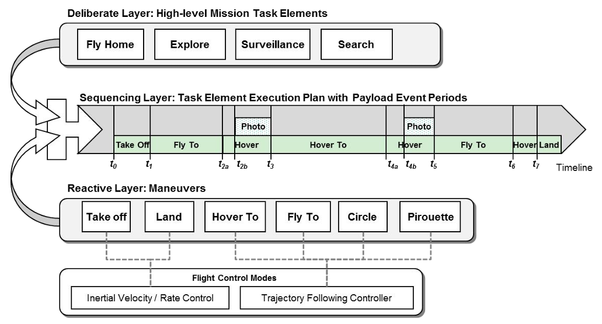

# Mission Architecture

AutoAPMS allows users to create operational procedures using behavior trees. A single behavior tree may define more or less complex rules and mechanisms for orchestrating robot actions to achieve a specific goal. Depending on the application and the underlying real-time system, various different strategies can be pursued when assembling the associated behavior tree nodes. It's the user who's responsible for determining a suitable strategy and applying it to define the desired behavior.

During operation, every automated system is susceptible to unexpected events that could jeopardize the success of a mission/application. To cope with such events, the system must also be able to detect critical aberrations and dynamically adapt the current behavior. In other words, it's important to implement reactive behaviors when designing robotic applications.

Developing a resilient **system architecture for executing missions in a real-world environment** where spontaneous events potentially require dynamic task reallocation is a hot research topic. By using AutoAPMS's powerful behavior development framework, it's possible to work on this problem from a high level of abstraction.

Recent research results advocate to distinguish between the following three tiers or layers which are associated with the tactical phase of an operation (the time period where the mission is running):

- **Deliberate Layer**

    High-level, situation aware (re)planning of behaviors.

- **Sequencing Layer**

    Execution of goal-oriented procedures represented by behavior trees.

- **Reactive Layer**

    Applying generic functions and action primitives using behavior tree nodes.

The figure below shows how these tiers/layers interact with each other and applies this architecture to an unmanned aerial system which is supposed to perform a simple monitoring mission:

- Model based, hybrid control

## Event management

### Contingencies vs. Emergencies

### Multilayered Control

## Related Research
<!-- markdown-link-check-disable-next-line -->
- [Usach, H.; Torens, C. et al. (2017): Architectural Considerations Towards Automated Contingency Management for Unmanned Aircraft](https://doi.org/10.2514/6.2017-1293)

- [Müller, R. and Bauer, M. (2024): Automated Mission Management of Small Unmanned Aircraft Systems for Critical Events in Urban Air Traffic](https://doi.org/10.5220/0012951500003822)
