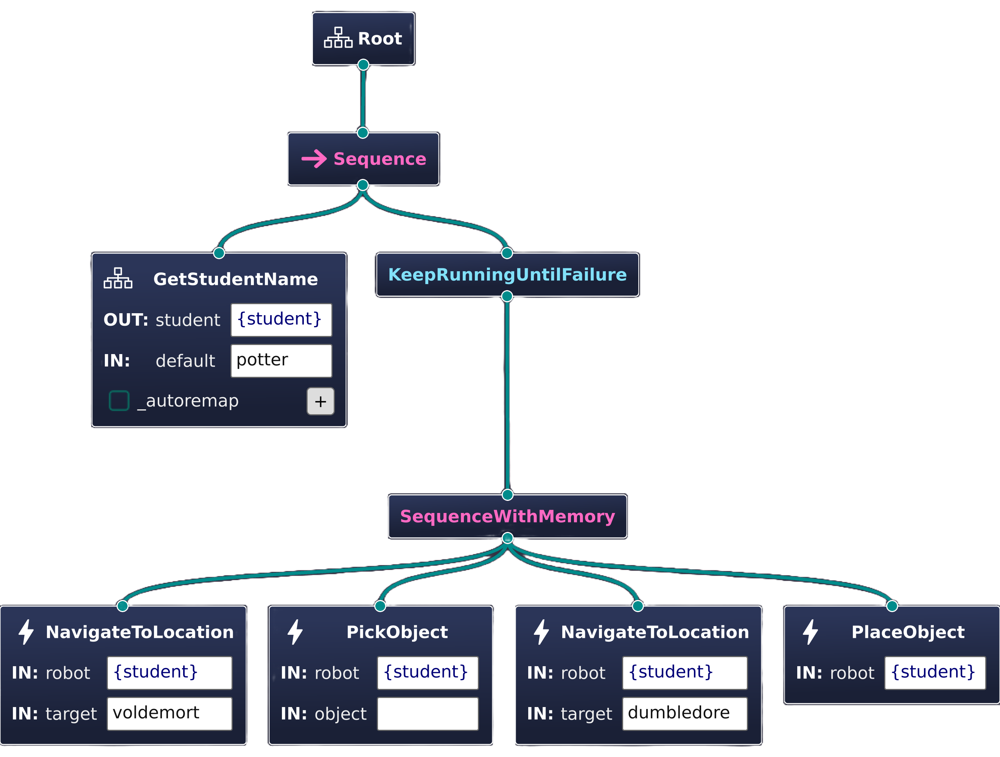

# What are Behavior Trees?

Within AutoAPMS, the behavior tree paradigm is used for modeling robotic behaviors and task planning. We adopt the C++ implementation offered by [BehaviorTree.CPP](https://github.com/BehaviorTree/BehaviorTree.CPP).

Generally speaking, behavior trees are composed of nodes (not ROS 2 nodes, but behavior tree specific nodes) that are assembled with respect to each other's position within the tree. They are considered the building blocks of a behavior tree. Various different types of nodes have been defined by different research results. We stick to the following definition:

Node Type | Number of Children | Description
--- | :---: | ---
**Control** | At least 1 | Passes the tick to its children based on certain rules and takes each child's result **status** into account.
**Decorator** | Exactly 1 | Executes a certain function before or after passing the tick to its child.
**Condition** | Exactly 0 | Used for determining if a certain condition is met or not.
**Action** | Exactly 0 | Performs work in an synchronous or asynchronous manner.

As you can see, **Control** and **Decorator** nodes are allowed to have nodes as children, so there is a parent-child relation. This property makes behavior trees hierarchically structured. When we speak of "ticking" a behavior tree node, it means that we invoke the tick callback function that is implemented by each node. This function always returns a status that must be one of the following:

Status | Meaning
--- | ---
**SUCCESS** or **FAILURE** | The node finished executing and the respective job either succeeded or failed.
**RUNNING** | The node needs more time to determine the final result. This enables asynchronous execution.
**SKIPPED** | Special status for indicating that the parent node should not tick this node and proceed to the next one.

With these definitions you are able to create complex task plans. For example the behavior tree from the [installation example](../installation/#launch-an-example) looks like this:

For more information about behavior trees and their C++ implementation, refer to the [documentation](https://www.behaviortree.dev/docs/intro#what-is-a-behavior-tree) of the **BehaviorTree.CPP** project.
