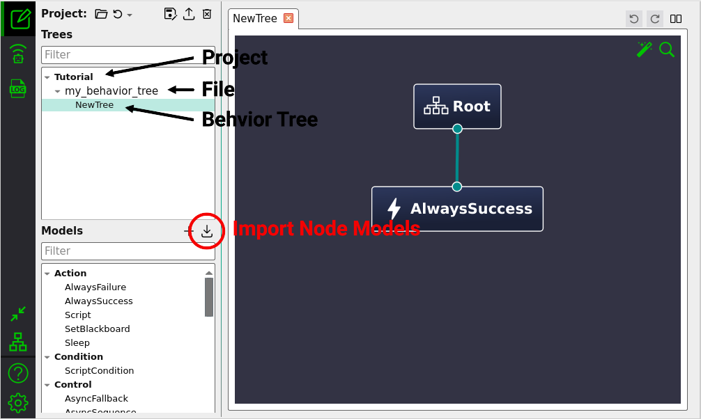

# Building Behavior Trees

Behavior trees are composed of nodes that can be considered clients to a specific function. They may for example request to execute a skill/task in order to query information or perform an action. So before you're able to build custom behavior trees, you must implement ROS 2 nodes that act as servers for the required functionality. Refer to our [guidelines](../concept/fundamentals.md#_1-implementing-skills) for implementing these.

AutoAPMS comes with various [standard behavior tree nodes](../reference/behavior-tree-nodes.md) out of the box. As described by the previous tutorial, we also provide a powerful toolchain that allows users to [implement custom behavior tree nodes](./implementing-behavior-tree-nodes.md) according to the needs of the their respective applications.

This tutorial aims to demonstrate how users can actually build behavior trees and incorporate behavior tree nodes to achieve any arbitrary, application specific goal. In general, behavior trees can be created using two different approaches:

| | Advantages 👍 | Disadvantages 👎 |
| :---: | :---: | :---: |
| [Graphical Approach](#graphical-approach) | "Human-friendly" behavior tree representation — Drag-and-drop interaction — Quick prototyping | Requires additional software — Limited composability |
| [Programmatic Approach](#programmatic-approach) | Static type checking at compile time — Build automation — Essential for scripting | Behavior tree structure is less comprehensible — Source code quickly becomes difficult to understand |

Both approaches are fundamentally different and should be chosen according to the behavior's use case or just based on personal preference.

## Graphical Approach

You should build your behavior tree **graphically** if

- you are prototyping and want to quickly explore an idea,
- the application you're designing is not that complex or
- you prioritize visual comprehensibility over complicated C++ source code.

The visual editor we recommend is called [Groot2](https://www.behaviortree.dev/groot) and designed by the same person who maintains the BehaviorTree.CPP library AutoAPMS builds upon.

### Using Groot2

Groot2 allows you to manage all your behavior tree files in one place. To start building a behavior tree file, you need to create a new `.xml` file. You can do that manually or run this convenient command that automatically writes an empty behavior tree to the given file.

```bash [Terminal]
ros2 run auto_apms_behavior_tree new_tree "behavior/my_behavior_tree.xml"
```

::: tip
Also consider using the corresponding [VSCode Task](https://code.visualstudio.com/Docs/editor/tasks) which does the same thing.

➡️ `Terminal -> Run Task... -> Write empty behavior tree`

You must manually create an empty `.xml` file and open it before executing this task, since the current opened file will be used.
:::

Let's launch the Groot2 application and open/create a behavior tree file called `my_behavior_tree.xml`.



Groot2 allows to build behavior trees by dragging and dropping node icons. However, you must explicitly tell the application how your custom nodes are called, which type they have and what data ports they implement. This is what [behavior tree node model XML files](../concept/common-resources.md#node-model-xml-file) are used for. These files hold information about custom nodes that you want to use in Groot2 for creating a specific behavior. They must manually be loaded using the "Import Node Models" button marked in red.

Given that you [added node manifests](./implementing-behavior-tree-nodes.md#adding-node-manifests) and built the corresponding package, CMake already created the node model files we require and installed it to your ROS 2 workspace. What you have to do now is to click the "Import Node Models" button, find the share directory of the package that contains your custom nodes and navigate to AutoAPMS's behavior tree node metadata directory:

::: tabs

=== Normal Install

`install`/`<my_package>`/`share`/`<my_package>`/`auto_apms`/`auto_apms_behavior_tree_core`/`metadata`

=== Merge Install

`install`/`share`/`<my_package>`/`auto_apms`/`auto_apms_behavior_tree_core`/`metadata`

:::

::: info You can also inspect the build directory
When building with `symlink-install` enabled, the install directory only contains symbolic links to the node model files. The originally generated files reside in

`build`/`<my_package>`/`auto_apms_behavior_tree_core`
:::

Inside this directory, you'll find files named like `node_model_<metadata_id>.xml`. Select the one that is associated with your use case and "Open" it. If you are not sure which `<metadata_id>` is the correct one, read the guide on [referring to node manifests](./implementing-behavior-tree-nodes.md#referring-to-node-manifests). It explains how the suffix for the node model XML files is determined.

You'll notice that Groot2 has added the corresponding nodes to the list of "Models" on the lower left. You may drag and drop any of these nodes to the workspace area and use them as you'd like. Make sure to understand the [general concept of behavior trees](../concept/behavior-trees.md) before you start assembling nodes.

To actually distribute your behavior tree within your ROS 2 workspace, you must add the following to the CMakeLists.txt of the corresponding package:

```cmake [CMakeLists.txt]
find_package(auto_apms_behavior_tree REQUIRED)
# ...
auto_apms_behavior_tree_register_trees(
  "behavior/my_behavior_tree.xml"  # You must provide at least one XML file
  # ...
)
```

::: tip Convention 📜
We recommend storing your behavior tree files under a directory called `behavior`. However, you can put them wherever you want, you just have to adjust the file paths you pass to `auto_apms_behavior_tree_register_trees` accordingly.
:::

This registers the behavior tree with the resource index and enables you to easily locate the corresponding XML file at runtime. You can refer to a registered tree using for example `TreeDocument::mergeResource` which is demonstrated [below](#using-treedocument).

A behavior tree resource can also be used to [deploy the corresponding behavior](./deploying-behaviors.md) using the command line or a launch file.

## Programmatic Approach

You should build your behavior tree **programmatically** if

- you want to automatically generate behavior trees based on user input,
- your application depends on behavior tree resources which are not available as static XML files or
- you prefer to leverage all the functionality that comes with C++ for a different reason and like to do it the nerdy way.

This approach requires you to be familiar with AutoAPMS's behavior tree builder API. Most of this functionality is encapsulated by two central C++ classes:

- [`TreeDocument`](https://robin-mueller.github.io/auto-apms/classauto__apms__behavior__tree_1_1core_1_1TreeDocument.html)

  Implements a [Document Object Model (DOM)](https://de.wikipedia.org/wiki/Document_Object_Model) for the [behavior tree XML schema](https://www.behaviortree.dev/docs/learn-the-basics/xml_format). It offers a modular, streamlined API to create and modify the XML representation of behavior trees within ROS 2 workspaces.

- [`TreeBuildHandler`](https://robin-mueller.github.io/auto-apms/classauto__apms__behavior__tree_1_1TreeBuildHandler.html)

  Introduces a plugin-based approach for implementing specialized algorithms for building behavior trees. When deploying behaviors, users may dynamically load plugins created by inheriting from this class to customize how the [behavior tree executor](../concept/behavior-executor.md) interprets incoming build requests.

Both classes are essential for the programmatic approach. In the following, we'll elaborate common use cases. If you want to see a full example that applies the programmatic approach for building a specific behavior tree, refer to [Creating a Behavior Tree From Scratch: Build the Behavior Tree](./creating-a-behavior-from-scratch.md#build-the-behavior-tree).

### Using `TreeDocument`

When working with `TreeDocument`, it's very important to have a good understanding of a behavior tree's graphical representation. Building behavior trees programmatically is much less intuitive than doing it graphically. Getting used to the workflow and the C++ abstractions probably requires some time. Nevertheless, this approach is essential for automating the process of building behavior trees.

In the following, we want to demonstrate the basic usage of `TreeDocument` and provide information about all the data structures involved. For detailed information about specific methods, you should refer to the API Documentation.

Let's first include the corresponding header and instantiate a tree document. This can be anywhere in the source code of your ROS 2 package:

```cpp:line-numbers
#include "auto_apms_behavior_tree/document.hpp"

using TreeDocument = auto_apms_behavior_tree::core::TreeDocument;

// The tree document must be kept alive throughout this scope
TreeDocument doc;

// Do something with doc here
```

Initially, the `doc` holds the content of an empty behavior tree document file:

```xml
<root BTCPP_format="4">
    <!-- There are no behavior trees yet -->
</root>
```

#### Adding an existing behavior tree

To start off, you might want to load a behavior tree that you previously registerd using `auto_apms_behavior_tree_register_trees` and add it to the document. This can be done using the corresponding [resource identity](../concept/common-resources.md#tree-identity). However, you can also add a tree without querying the resource index. There are multiple ways to achieve the same thing:

```cpp:line-numbers=8
// If you have only a single tree, the <root> element can be dropped
std::string tree_str = R"(
<BehaviorTree ID="MyTreeName">
    <Sequence>
      <AlwaysSuccess/>
      <ScriptCondition code="true"/>
    </Sequence>
</BehaviorTree>
)";

bool adopt_root_tree = true;
doc.mergeString(tree_str, adopt_root_tree);
doc.mergeFile("/path/to/behavior_tree.xml", adopt_root_tree);
doc.mergeResource("my_package::my_behavior_tree::MyTreeName", adopt_root_tree);
// OR
TreeDocument::TreeElement tree = doc.newTreeFromString(tree_str).makeRoot();
TreeDocument::TreeElement tree = doc.newTreeFromFile("/path/to/behavior_tree.xml").makeRoot();
TreeDocument::TreeElement tree = doc.newTreeFromResource("my_package::my_behavior_tree::MyTreeName").makeRoot();
```

#### Creating a new behavior tree

You may as well start from scratch and create your behavior tree by manually inserting any behavior tree nodes you want:

::: code-group

```cpp:line-numbers=8 [Using Node Models]
// Include the standard node models
#include "auto_apms_behavior_tree/behavior_tree_nodes.hpp"

// Bring the node model namespace into scope
using namespace auto_apms_behavior_tree;

TreeDocument::TreeElement tree = doc.newTree("MyTreeName").makeRoot();
model::Sequence sequence = tree.insertNode<model::Sequence>();
sequence.insertNode<model::AlwaysSuccess>();
sequence.insertNode<model::ScriptCondition>().set_code("true");
```

```cpp:line-numbers=8 [Using only Registration Names]
// We don't need this if we don't use node models
// #include "auto_apms_behavior_tree/behavior_tree_nodes.hpp"

// Bring the node model namespace into scope
// using namespace auto_apms_behavior_tree;

TreeDocument::TreeElement tree = doc.newTree("MyTreeName").makeRoot();
TreeDocument::NodeElement sequence = tree.insertNode("Sequence");
sequence.insertNode("AlwaysSuccess");
sequence.insertNode("ScriptCondition").setPorts({{"code", "true"}});
```

:::

Here you can choose if you want to incorporate [node models](../concept/common-resources.md#behavior-tree-node-models) or not. We generally recommend to do so wherever possible, because it allows verifying the behavior tree's structure at compile time. Additionally, we provide getters and setters for all data ports. Your IDE (e.g. VSCode) will also be able to provide you with convenient type hints and usage suggestions.

#### Inserting custom nodes

Until now, we have only showed you how to add [standard nodes](../reference/behavior-tree-nodes.md) provided by the `auto_apms_behavior_tree` package to your behavior tree. However, this principle also applies for any behavior tree nodes you implement yourself.

`TreeDocument` automatically checks whether the registration name of a specific node is available, when you try to insert it. At construction time, your workspace is parsed for corresponding resources using the `NodeRegistrationLoader` passed to the constructor. If you try to insert any nodes that the loader doesn't know about, an error is raised.

Therefore, you must provide [registration options](./implementing-behavior-tree-nodes.md#about-registration-options) whenever you refer to a custom node the first time. The document object caches the corresponding information until its destruction (registration options persist even if all associated nodes are removed from the document).

To be able to insert user-defined nodes you must make sure that the CMakeLists.txt of your package fulfills the following requirements:

- Custom nodes must be registered using [`auto_apms_behavior_tree_register_nodes`](../reference/cmake.md#register-nodes). Otherwise, `NodeRegistrationLoader` will not be able to find the corresponding plugin classes.

- The `NODE_MANIFEST` keyword argument must be used to provide one or more node manifests that define which registration options go for which registration name. **The list of available registration names is determined by the given node manifests.**

- *When using node models only:* The `NODE_MODEL_HEADER_TARGET` keyword argument must be specified and the C++ source files must link against the given target.

All of this is described in the tutorial about [implementing custom nodes](./implementing-behavior-tree-nodes.md).

In the following minimal example we assume, that the user implements `my_namespace::MyCustomNodeClass` (part of shared library `custom_nodes`) inside the ROS 2 package `my_package` and provides the following configuration:

```cmake [CMakeLists.txt]
# We assume that custom_nodes and my_source_target are already defined
auto_apms_behavior_tree_register_nodes(custom_nodes
  "my_namespace::MyCustomNodeClass"
  NODE_MANIFEST
  "config/node_manifest.yaml"
  NODE_MODEL_HEADER_TARGET
  my_source_target
)
```

```yaml [config/node_manifest.yaml]
MyCustomNode:
  class_name: my_namespace::MyCustomNodeClass
```

Consequently, one may incorporate the custom node models in a source file of the shared library `my_source_target` (generated under namespace `my_namespace::model`). If the user decides otherwise, the registration options of `MyCustomNode` must be given manually:

::: code-group

```cpp:line-numbers=8 [Using Node Models]
// Include the standard AND the custom node models
#include "auto_apms_behavior_tree/behavior_tree_nodes.hpp"
#include "my_package/custom_nodes.hpp"  // [!code focus]

// Bring the node model namespaces into scope
using namespace auto_apms_behavior_tree;
using namespace my_namespace;  // [!code focus]

TreeDocument::TreeElement tree = doc.newTree("MyTreeName").makeRoot();
model::Sequence sequence = tree.insertNode<model::Sequence>();
sequence.insertNode<model::AlwaysSuccess>();

// Add the custom node
sequence.insertNode<model::MyCustomNode>();  // [!code focus]
```

```cpp:line-numbers=8 [Using only Registration Names]
// We don't need this if we don't use node models
// #include "auto_apms_behavior_tree/behavior_tree_nodes.hpp"
// #include "my_package/custom_nodes.hpp"

// Bring the node model namespaces into scope
// using namespace auto_apms_behavior_tree;
// using namespace my_namespace;

TreeDocument::TreeElement tree = doc.newTree("MyTreeName").makeRoot();
TreeDocument::NodeElement sequence = tree.insertNode("Sequence");
sequence.insertNode("AlwaysSuccess");

// Add the custom node
auto_apms_behavior_tree::core::NodeRegistrationOptions options;  // [!code focus:6]
options.class_name = "my_namespace::MyCustomNodeClass";
sequence.insertNode("MyCustomNode", options);
// OR
doc.registerNodes(auto_apms_behavior_tree::core::NodeManifest::fromResourceIdentity("my_package::custom_nodes"));
sequence.insertNode("MyCustomNode");
```

:::

::: warning Watch out for naming collisions!

In this snippet we brought both `my_namespace::model` and `auto_apms_behavior_tree::model` into the same scope with the `using namespace` directive. While it is convenient and safe in this case, you must generally be aware that there can be naming collisions when writing source code like this. There can be duplicate node model class names if a ROS 2 package defines a node manifest which contains any registration names already assigned by other packages and generates a model header using manifest.

:::

### Using `TreeBuildHandler`

The package `auto_apms_behavior_tree` comes with standard behavior build handlers. You can learn more about how to use them [here](../concept/common-resources.md#behavior-build-handlers). In the following, we want to explain how you implement build handlers yourself.

Similar to how it's done with custom behavior tree nodes, one must register custom behavior build handlers with the resource index and make them discoverable for `pluginlib::ClassLoader`. Our convention requires you to

1. Call the C++ macro [`AUTO_APMS_BEHAVIOR_TREE_REGISTER_BUILD_HANDLER`](https://robin-mueller.github.io/auto-apms/group__auto__apms__behavior__tree.html#ga45fa41d82d2b212962433e6653b2e0c9) inside the `.cpp` source file. You may call it multiple times for all your custom build handler classes.

2. Call the CMake macro [`auto_apms_behavior_tree_register_build_handlers`](../reference/cmake.md#register-build-handlers) inside the CMakeLists.txt of your package. You may pass multiple class names to the same call.

Here's an example:

::: code-group

```cpp [src/my_build_handler.cpp]
#include "auto_apms_behavior_tree/build_handler.hpp"
 
namespace my_namespace
{

class MyCustomBuildHandler : public auto_apms_behavior_tree::TreeBuildHandler
{
public:
  using TreeBuildHandler::TreeBuildHandler;
 
  bool setBuildRequest(const std::string & build_request,
                       const NodeManifest & node_manifest,
                       const std::string & root_tree_name) override final
  {
    /**
     * Do something when a build request arrives. If this isn't overridden, 
     * all requests are accepted regardless of the arguments given above.
     */

    // ...
 
    // Returning true means accepting the request, false means rejecting it
    return true;
  }
 
  TreeDocument::TreeElement buildTree(TreeDocument & doc,
                                      TreeBlackboard & bb) override final
  {
    // Configure the behavior tree
    TreeDocument::TreeElement tree = doc.newTree("MyTreeName");

    // ...
 
    /**
     * The returned tree element must point to a behavior tree within doc
     * and will be used as the root tree.
     */
    return tree;
  }
};

}  // namespace my_namespace
 
// Make sure the plugin class is discoverable
AUTO_APMS_BEHAVIOR_TREE_REGISTER_BUILD_HANDLER(my_namespace::MyCustomBuildHandler)
```

```cmake [CMakeLists.txt]
project(my_package)

find_package(ament_cmake REQUIRED)
find_package(auto_apms_behavior_tree REQUIRED)
 
# Create a shared library that contains the build handler
add_library(my_build_handler_library_target SHARED
  "src/my_build_handler.cpp"  # Add the source file
)
target_link_libraries(my_build_handler_library_target PUBLIC
  # The library must link against auto_apms_behavior_tree
  auto_apms_behavior_tree::auto_apms_behavior_tree
)
 
# Register your custom build handler
auto_apms_behavior_tree_register_build_handlers(my_build_handler_library_target
  "my_namespace::MyCustomBuildHandler"
)
 
# Install the shared library to the standard directory
install(
  TARGETS
  my_build_handler_library_target
  LIBRARY DESTINATION lib
  ARCHIVE DESTINATION lib
  RUNTIME DESTINATION bin
)

ament_package()
```

:::

The snippet above shows the core structure of a build handler class. `buildTree` provides a straightforward interface and a scope for applying the `TreeDocument` API. This callback is designed to allow the developer to fully focus on what's important: Writing the code which actually creates the behavior tree.

You should note that it's also possible to reimplement the constructor. This may look like this:

```cpp
MyCustomBuildHandler(rclcpp::Node::SharedPtr ros_node_ptr, 
                     NodeLoader::SharedPtr tree_node_loader_ptr)
: MyCustomBuildHandler("my_build_handler_name", 
                        ros_node_ptr, 
                        tree_node_loader_ptr)
{
  // Initialize values, create ROS 2 subscribers, timers, etc.
}
```

This allows for giving the build handler a custom name (only used for logging as of now) and initializing values at construction time. Considering that you can also set up any ROS 2 waitables using `ros_node_ptr` (a pointer to the parent `rclcpp::Node`), there's really nothing you can't do with a build handler. The user may fully leverage the ROS 2's functionality and see the build handler as yet another node in the system, or the strategy for implementing `setBuildRequest` and `buildTree` may be less sophisticated. In the end, it massively depends on the application and the context in which AutoAPMS is used.

In the next tutorial you'll learn about how to configure the behavior executor to use a specific, potentially user-defined build handler.
