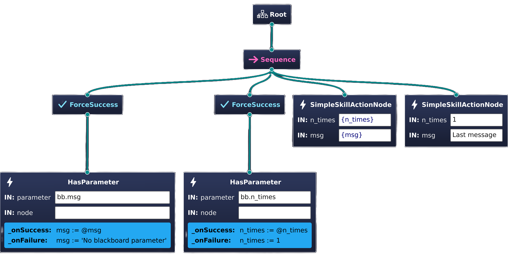

# Creating a Behavior From Scratch

In this tutorial we will implement and execute a simple behavior tree starting from scratch. By the end of it, you'll be familiar with every development step required for creating behaviors with AutoAPMS.

The full source code of the following examples can be found in the GitHub repository inside the package [`auto_apms_examples`](https://github.com/autoapms/auto-apms/blob/master/auto_apms_examples).

[[toc]]

## Implement a Simple Skill

We're going to create a simple skill that repeatedly prints a given text to the terminal. To achieve this using AutoAPMS and ROS 2, we need to implement an action server that performs the task of writing to the terminal and a separate client that is supposed to send a message specifying the goal of the action. You could approach this development task by sticking to the [official ROS 2 tutorial for writing an action](https://docs.ros.org/en/jazzy/Tutorials/Intermediate/Writing-an-Action-Server-Client/Cpp.html). However, we'd like to show you a more streamlined and modular approach enabled by AutoAPMS.

### Action Interface

To define your ROS 2 interfaces, it's common practice to create a separate package that contains `.msg`, `.service` and `.action` files for topics, services and actions respectively. We name this package `my_package_interfaces` and create the following interface file:

```txt [action/ExampleSimpleSkill.action]
# Request
string msg
uint8 n_times 1
---
# Result
float64 time_required
---
# Feedback
```

### Server

For implementing robot skills using a ROS 2 action server, we provide the helper class [`ActionWrapper`](https://autoapms.github.io/auto-apms/classauto__apms__util_1_1ActionWrapper.html). The `SimpleSkillServer` shown below provides the functionality we want:

<<< ./simple_skill.cpp#server [src/simple_skill_server.cpp]

All we have to do in the CMakeLists.txt of our package is to invoke this macro provided by [`rclcpp_components`](https://github.com/ros2/rclcpp/tree/jazzy/rclcpp_components) (assuming you add the server's source file to a shared library called "simple_skill_server"):

::: code-group

```cmake [CMakeLists.txt (With server executable)]
project(my_package)

find_package(ament_cmake REQUIRED)
find_package(rclcpp_components REQUIRED)
find_package(my_package_interfaces REQUIRED)
find_package(auto_apms_util REQUIRED)

# Create shared library
add_library(simple_skill_server SHARED
  "src/simple_skill_server.cpp"  # Replace with your path
)
target_link_libraries(simple_skill_server PUBLIC
  rclcpp_components::component
  ${my_package_interfaces_TARGETS}
  auto_apms_util::auto_apms_util
)

# Register server component
rclcpp_components_register_node(simple_skill_server # [!code highlight:4]
PLUGIN "my_namespace::SimpleSkillServer"
  EXECUTABLE "simple_skill_server"
)
# Allows you to simply start the server by running
# ros2 run <package_name> simple_skill_server

# Install the shared library to the standard directory
install(
  TARGETS
  simple_skill_server
  LIBRARY DESTINATION lib
  ARCHIVE DESTINATION lib
  RUNTIME DESTINATION bin
)

ament_package()
```

```cmake [CMakeLists.txt (Without server executable)]
project(my_package)

find_package(ament_cmake REQUIRED)
find_package(rclcpp_components REQUIRED)
find_package(my_package_interfaces REQUIRED)
find_package(auto_apms_util REQUIRED)

# Create shared library
add_library(simple_skill_server SHARED
    "src/simple_skill_server.cpp"  # Replace with your path
)
target_link_libraries(simple_skill_server PUBLIC
  rclcpp_components::component
  ${my_package_interfaces_TARGETS}
  auto_apms_util::auto_apms_util
)

# Register server component
rclcpp_components_register_nodes(simple_skill_server # [!code highlight:3]
  "my_namespace::SimpleSkillServer"
)
# No executable file is generated. You must manually do that
# or write a launch script that loads this ROS 2 node component

# Install shared libraries to the standard directory
install(
  TARGETS
  simple_skill_server
  LIBRARY DESTINATION lib
  ARCHIVE DESTINATION lib
  RUNTIME DESTINATION bin
)

ament_package()
```

:::

### Client

Until now, we've pretty much only applied the standard ROS 2 workflow. This is about to change when we create the client for `SimpleSkillServer`. Very differently to what you're used to with ROS 2, the `SimpleSkillClient` in the following snippet does **NOT** inherit the interface of a typical `rclcpp::Node`. When using AutoAPMS, we prefer to [implement clients as behavior tree nodes](./implementing-behavior-tree-nodes.md). In this case, it is a [`RosActionNode`](https://autoapms.github.io/auto-apms/classauto__apms__behavior__tree_1_1core_1_1RosActionNode.html).

<<< ./simple_skill.cpp#client [simple_skill_client.cpp]

Just like with the server, we must also add something to the CMakeLists.txt of our package to actually make use of the `SimpleSkillClient` node. AutoAPMS provides a CMake macro that makes it easy for you to register custom nodes with the [`ament_index`](https://github.com/ament/ament_index?tab=readme-ov-file), a core package of ROS 2 that allows installing resources which can be queried at runtime. The following assumes that you add the client node's source file to a shared library called "simple_skill_nodes".

```cmake:line-numbers [CMakeLists.txt (Client)]
project(my_package)

find_package(ament_cmake REQUIRED)
find_package(my_package_interfaces REQUIRED)
find_package(auto_apms_behavior_tree REQUIRED)

# Create shared library for the node
add_library(simple_skill_nodes SHARED
  "src/simple_skill_client.cpp"
)
target_link_libraries(simple_skill_nodes PUBLIC
  ${my_package_interfaces_TARGETS}
  auto_apms_behavior_tree::auto_apms_behavior_tree
)

# Register client behavior tree node
auto_apms_behavior_tree_register_nodes(simple_skill_nodes # [!code highlight:3]
  "my_namespace::SimpleSkillClient"
)

# Install shared libraries to the standard directory
install(
  TARGETS
  simple_skill_nodes
  LIBRARY DESTINATION lib
  ARCHIVE DESTINATION lib
  RUNTIME DESTINATION bin
)

ament_package()
```

By "registering a node" we expose the class as a plugin resource and make it discoverable at runtime. Note that registering a node works very similar to what we've done with `SimpleSkillServer`.

  Type  | C++ | CMake
--- | --- | ---
**Server** | [`RCLCPP_COMPONENTS_REGISTER_NODE`](https://docs.ros.org/en/jazzy/p/rclcpp_components/generated/define_register__node__macro_8hpp_1a544e598f1116a756e7440b8ce8bc5296.html#c.RCLCPP_COMPONENTS_REGISTER_NODE) | [`rclcpp_components_register_node`](https://github.com/ros2/rclcpp/blob/jazzy/rclcpp_components/cmake/rclcpp_components_register_node.cmake) [`rclcpp_components_register_nodes`](https://github.com/ros2/rclcpp/blob/jazzy/rclcpp_components/cmake/rclcpp_components_register_nodes.cmake)
**Client** | [`AUTO_APMS_BEHAVIOR_TREE_REGISTER_NODE`](https://autoapms.github.io/auto-apms/group__auto__apms__behavior__tree.html#ga5ce6f5e1249a2f980b0487ca8bb95c08) | [`auto_apms_behavior_tree_register_nodes`](../reference/cmake.md#auto-apms-behavior-tree-register-nodes)

## Create a Behavior

With both server and client implemented, we are done writing the low-level source code and ready to climb up the ladder of abstraction: We may now build our first behavior tree and actually employ the functionality we've just created!

### Configure a Node Manifest

As you know, behavior trees are composed of nodes. When using AutoAPMS, all behavior tree nodes are plugins (except for the builtin/native nodes statically implemented by BehaviorTree.CPP) are loaded at runtime when the tree is created. To specify which node classes to load and how to instantiate them, you must specify so-called **registration options**. To reproduce this example, you don't need to know the details about this concept. Nevertheless, feel encouraged to check out the concept page for [node manifests](../concept/common-resources.md#behavior-tree-node-manifests).

The node manifest for the behavior tree we're going to build looks like this:

```yaml [config/simple_skill_node_manifest.yaml]
SimpleSkillActionNode:
  class_name: my_namespace::SimpleSkillClient
  topic: simple_skill

HasParameter:
  class_name: auto_apms_behavior_tree::HasParameter
```

We want to include two custom nodes in our behavior tree:

- **SimpleSkillActionNode**

  This is the node that acts as a client to the `simple_skill` action we implemented above. As mentioned before, we need to include this node to send the action goal to the server.

- **HasParameter**

  We additionally incorporate a node that allows us to determine if the tree executor defines a certain ROS 2 parameter. This allows us to determine if we it's valid to retrieve the value of `n_times` from the executor's parameters. This node is one of many [standard nodes](../reference/behavior-tree-nodes.md) provided by the package `auto_apms_behavior_tree`.

Before we're able to build our behavior tree, we must make sure that our node manifest will be available at runtime. This is achieved by registering one more `ament_index` resource using the `NODE_MANIFEST` argument accepted by the CMake macros `auto_apms_behavior_tree_register_nodes` and `auto_apms_behavior_tree_register_trees`. The following section defines the corresponding CMakeLists.txt. Visit the designated tutorial towards [adding node manifests](./implementing-behavior-tree-nodes.md#adding-node-manifests) to learn more about the details.

### Update the Client Package

You must modify the CMakeLists.txt of your package according to how you intend to create the behavior tree. We distinguish between two general approaches: You may either create a behavior tree **graphically** using a suitable visual editor or **programmatically** by incorporating the C++ API offered by AutoAPMS. The following shows the required configuration for both approaches:

::: tabs key:approach

=== Graphical Approach

You just need to add `auto_apms_behavior_tree_register_trees`.

```cmake:line-numbers [CMakeLists.txt]
project(my_package)

find_package(ament_cmake REQUIRED)
find_package(my_package_interfaces REQUIRED)
find_package(auto_apms_behavior_tree REQUIRED)

# Create shared library for the node
add_library(simple_skill_nodes SHARED
  "src/simple_skill_client.cpp"
)
target_link_libraries(simple_skill_nodes PUBLIC
  ${my_package_interfaces_TARGETS}
  auto_apms_behavior_tree::auto_apms_behavior_tree
)

# Register client behavior tree node
auto_apms_behavior_tree_register_nodes(simple_skill_nodes
  "my_namespace::SimpleSkillClient"
)

# Register simple skill tree
auto_apms_behavior_tree_register_trees( # [!code ++:5]
  "behavior/simple_skill_tree.xml"
  NODE_MANIFEST
  "config/simple_skill_node_manifest.yaml"
)

# Install shared libraries to the standard directory
install(
  TARGETS
  custom_nodes
  LIBRARY DESTINATION lib
  ARCHIVE DESTINATION lib
  RUNTIME DESTINATION bin
)

ament_package()
```

=== Programmatic Approach

You need to create a separate shared library that contains source code for a so-called [behavior build handler](../concept/common-resources.md#behavior-build-handlers). We recommend passing the target to the `NODE_MODEL_HEADER_TARGET` argument of `auto_apms_behavior_tree_register_nodes` to be able to incorporate [node models](../concept/common-resources.md#c-node-model-header). Additionally, you must make sure to specify the name of the build handler class using `auto_apms_behavior_tree_register_build_handlers` and install the extra library.

```cmake:line-numbers [CMakeLists.txt]
project(my_package)

find_package(ament_cmake REQUIRED)
find_package(my_package_interfaces REQUIRED)
find_package(auto_apms_behavior_tree REQUIRED)

# Create shared library for the node
add_library(simple_skill_nodes SHARED
  "src/simple_skill_client.cpp"
)
target_link_libraries(simple_skill_nodes PUBLIC
  ${my_package_interfaces_TARGETS}
  auto_apms_behavior_tree::auto_apms_behavior_tree
)

# Create another shared library for the build handler
add_library(simple_skill_build_handler SHARED # [!code ++:6]
    "src/simple_skill_build_handler.cpp"
)
target_link_libraries(simple_skill_build_handler PUBLIC
  auto_apms_behavior_tree::auto_apms_behavior_tree
)

# Register client behavior tree node
auto_apms_behavior_tree_register_nodes(simple_skill_nodes
  "my_namespace::SimpleSkillClient"
  NODE_MANIFEST # [!code ++:4]
  "config/simple_skill_node_manifest.yaml"
  NODE_MODEL_HEADER_TARGET  # Optional: Generate models for custom nodes
  simple_skill_build_handler
)

# We can omit auto_apms_behavior_tree_register_trees in this example
# Instead, we implement a behavior build handler plugin

# Register the behavior build handler that will provide the tree
auto_apms_behavior_tree_register_build_handlers(simple_skill_build_handler # [!code ++:3]
  "my_namespace::SimpleSkillBuildHandler"
)

# Install shared libraries to the standard directory
install(
  TARGETS
  simple_skill_nodes
  simple_skill_build_handler # [!code ++]
  LIBRARY DESTINATION lib
  ARCHIVE DESTINATION lib
  RUNTIME DESTINATION bin
)

ament_package()
```

:::

::: tip Learn more 🎓
If you don't fully understand the CMakeLists.txt for the programmatic approach and want more detailed information about behavior build handlers, refer to the tutorial [Building Behavior Trees: Programmatic Approach](./building-behavior-trees.md#programmatic-approach).
:::

### Build the Behavior Tree

Let's define an arbitrary example behavior which uses the functionality provided by our simple skill to print a message to the terminal a specific amount of times. The following rules apply:

1. If a custom message was specified using a parameter, use this. Otherwise, use a default message.

1. If a custom number of prints to the terminal was specified using a parameter, use this. Otherwise, only print once.

1. After both variables have been determined, execute the `simple_skill` action with the corresponding goal.

1. To indicate that the behavior is finished, print a final message once.

For demonstration purposes, we implement this behavior using both the graphical and the programmatic approach:

::: tabs key:approach

=== Graphical Approach

The graphical representation of behavior trees is based on the XML format. So to define a behavior incorporating our simple skill, we must create a new `.xml` file from scratch. You can do that manually or run this convenient command that automatically writes an empty behavior tree to the given file.

```bash [Terminal]
ros2 run auto_apms_behavior_tree new_tree "behavior/simple_skill_tree.xml"
```

> [!TIP]
> Also consider using the corresponding [VSCode Task](https://code.visualstudio.com/Docs/editor/tasks) which does the same thing.
>
> ➡️ `Terminal -> Run Task... -> Write empty behavior tree`
>
> You must manually create an empty `.xml` file and open it before executing this task, since the current opened file will be used.

No matter how or where you create the behavior tree file, you'll probably need a visual editor for behavior trees. We recommend [Groot2](https://www.behaviortree.dev/groot/), because it's designed to be compatible with the behavior tree XML schema used by AutoAPMS and considered the de facto standard.

The graphical approach allows the user to quickly and intuitively configure the XML for the behavior tree For a step-by-step guide on [how to build a behavior tree using Groot2](./building-behavior-trees.md#using-groot2), follow the link to the corresponding tutorial. Below, we provide the graphical and the XML representation of our example behavior tree:



```xml [behavior/simple_skill_tree.xml]
<?xml version="1.0" encoding="UTF-8"?>
<root BTCPP_format="4"
      main_tree_to_execute="SimpleSkillDemo">
  <BehaviorTree ID="SimpleSkillDemo">
    <Sequence>
      <ForceSuccess>
        <HasParameter parameter="bb.msg"
                      node=""
                      _onSuccess="msg := @msg"
                      _onFailure="msg := &apos;No blackboard parameter&apos;"/>
      </ForceSuccess>
      <ForceSuccess>
        <HasParameter parameter="bb.n_times"
                      node=""
                      _onSuccess="n_times := @n_times"
                      _onFailure="n_times := 1"/>
      </ForceSuccess>
      <SimpleSkillActionNode n_times="{n_times}"
                             msg="{msg}"/>
      <SimpleSkillActionNode n_times="1"
                             msg="Last message"/>
    </Sequence>
  </BehaviorTree>
</root>

```

=== Programmatic Approach

We want to replicate the tree shown in the tab about the graphical approach. This requires us to use two central classes: `TreeDocument` and `TreeBuildHandler`. To make the source code more verbose and enable the compiler to detect behavior tree logic errors, we specified the `NODE_MODEL_HEADER_TARGET` argument of `auto_apms_behavior_tree_register_nodes` before:

```cmake:line-numbers=25 [CMakeLists.txt (Excerpt)]
auto_apms_behavior_tree_register_nodes(simple_skill_nodes
    "my_namespace::SimpleSkillClient"
    NODE_MANIFEST
    "config/simple_skill_node_manifest.yaml"
    NODE_MODEL_HEADER_TARGET  # Optional: Generate models for custom nodes [!code highlight:2]
    simple_skill_build_handler
)
```

If this argument is provided, CMake will automatically generate a `.hpp` file which contains specific classes that represent our custom nodes. These are what we refer to as behavior tree node models in C++. They are intended to be used as template arguments when building the tree. This is done by our custom build handler:

<<< ./simple_skill.cpp#build_handler [src/simple_skill_build_handler.cpp]

The `SimpleSkillBuildHandler` must be added to a shared library and registered with the resource index by configuring the CMakeLists.txt as shown [before](#update-the-client-package).

:::

::: info What are Global Blackboard Parameters?
This example behavior tree showcases a very useful concept introduced by AutoAPMS: [Global Blackboard Parameters](../concept/behavior-executor.md#global-blackboard). They are accessed using the `bb.`/`@` prefix and allow us to adjust the behavior without rebuilding the entire tree, thus makes it reusable. This is one of the reasons why AutoAPMS's adaption of the behavior tree paradigm is very well integrated with ROS 2.
:::

Congratulations! 🎉 You are now familiar with the general workflow of building behavior trees.

## Execute the Behavior

Finally, we're going to demonstrate how our simple skill and the behavior tree we've just created can be deployed. Make sure that you [build and install AutoAPMS](../introduction/getting-started.md#setting-up-the-workspace) and your custom package which contains the source code for the example described above (we called it `my_package` before).

```bash [Terminal]
colcon build --packages-up-to my_package --symlink-install
```

AutoAPMS conveniently provides an executable called `run_behavior` which we will use as shown in [Executing Behaviors](./deploying-behaviors.md#executing-a-behavior). To run the simple skill example, execute the following steps:

::: tabs key:approach

== Graphical Approach

If your created a behavior tree XML file using a graphical user interface like Groot2 or a simple text editor, it must be registered using the CMake macro `auto_apms_behavior_tree_register_trees`. This allows the behavior tree to be discovered at runtime. The recommended way of deploying the behavior is using the [`ros2 behavior run`](../reference/ros2behavior.md#ros2-behavior-run) CLI tool (requires package `auto_apms_ros2behavior`). However, you can also stick to using the lower level `run_behavior` executable that comes with `auto_apms_behavior_tree`.

```bash [Terminal]
ros2 behavior run "<package_name>::<tree_file_stem>::<tree_name>"
# OR
ros2 run auto_apms_behavior_tree run_behavior "<package_name>::<tree_file_stem>::<tree_name>"
```

> [!TIP]
> Also consider using the corresponding [VSCode Task](https://code.visualstudio.com/Docs/editor/tasks) which does the same thing.
>
> ➡️ `Terminal -> Run Task... -> Run behavior tree`

<h3>Run the Example (Graphical approach)</h3>

Let us demonstrate the intended usage of `run_behavior` for the behavior tree we created applying the **graphical approach**. AutoAPMS provides [`SimpleSkillServer`](#server), [`SimpleSkillClient`](#client) and the example tree called `SimpleSkillDemo` with the package `auto_apms_examples`. Other than executing the tree, you must of course make sure that the server providing our simple skill is started as well.

<h4>Using only the terminal</h4>

Start the simple skill server in its own terminal:

```bash [Terminal]
ros2 run auto_apms_examples simple_skill_server
```

Afterwards, create a new terminal and start executing the behavior tree:

```bash [Terminal]
ros2 behavior run auto_apms_examples::simple_skill_tree::SimpleSkillDemo
# OR
ros2 run auto_apms_behavior_tree run_behavior auto_apms_examples::simple_skill_tree::SimpleSkillDemo
```

<h4>Using a launch file</h4>

Or you do both in a single launch file similar to this:

```py [simple_skill_launch.py]
from launch import LaunchDescription
from launch_ros.actions import Node
from auto_apms_behavior_tree.launch import RunBehavior, BehaviorResource

def generate_launch_description():
    return LaunchDescription(
        [
            # Spawn the simple skill server
            Node(
                package="auto_apms_examples",
                executable="simple_skill_server"
            ),
            # Spawn the behavior tree executor for the simple skill tree
            RunBehavior(
                build_request=BehaviorResource(
                    "auto_apms_examples::simple_skill_tree::SimpleSkillDemo"
                )
            )
        ]
    )
```

```bash [Terminal]
ros2 launch auto_apms_examples simple_skill_launch.py approach:=graphical
```

<h4>Modify the behavior using parameters</h4>

Remember that we configured the behavior tree so that we can adjust the behavior according to the variables `msg` and `n_times`? They can be specified using ROS 2 parameters by either using [the command line](https://docs.ros.org/en/jazzy/How-To-Guides/Node-arguments.html#passing-ros-arguments-to-nodes-via-the-command-line) or [a launch file](https://docs.ros.org/en/jazzy/How-To-Guides/Launch-file-different-formats.html#). For example, run this:

```bash [Terminal]
ros2 behavior run auto_apms_examples::simple_skill_tree::SimpleSkillDemo --blackboard msg:="Custom message" n_times:=10
# OR
ros2 run auto_apms_behavior_tree run_behavior auto_apms_examples::simple_skill_tree::SimpleSkillDemo --ros-args -p bb.msg:="Custom message" -p bb.n_times:=10
```

Or add the parameters inside the launch file:

```py [simple_skill_launch.py]
from launch import LaunchDescription
from launch_ros.actions import Node
from auto_apms_behavior_tree.launch import RunBehavior, BehaviorResource

def generate_launch_description():
    return LaunchDescription(
        [
            # Spawn the simple skill server
            Node(
                package="auto_apms_examples",
                executable="simple_skill_server"
            ),
            # Spawn the behavior tree executor for the simple skill tree
            RunBehavior(
                build_request=BehaviorResource(
                    "auto_apms_examples::simple_skill_tree::SimpleSkillDemo"
                ),
                blackboard={"msg": "Custom message", "n_times": 10}  # [!code ++]
            )
        ]
    )
```

Try out setting the variables yourself!

== Programmatic Approach

If you decided to use the `TreeBuildHandler` abstraction and implemented a custom plugin which builds your behavior tree, there is no XML file that you can refer to when you want to execute your behavior. Instead, you must provide the class name of the corresponding build handler to `TreeExecutorNode`. This is achieved by setting a parameter named `build_handler`. When this parameter is set, the tree executor loads the given build handler plugin which allows the behavior tree to be built according to the underlying algorithm.

The user can set the `build_handler` parameter for `TreeExecutorNode` like any other ROS 2 parameter by either using [the command line](https://docs.ros.org/en/jazzy/How-To-Guides/Node-arguments.html#passing-ros-arguments-to-nodes-via-the-command-line) or [a launch file](https://docs.ros.org/en/jazzy/How-To-Guides/Launch-file-different-formats.html#).

### Run the Example (Programmatic approach)

Let us demonstrate the intended usage of `run_behavior` for the behavior tree we created applying the **programmatic approach**. AutoAPMS provides [`SimpleSkillServer`](#server), [`SimpleSkillClient`](#client) and the example build handler called `SimpleSkillBuildHandler` with the package `auto_apms_examples`. Other than executing the tree, you must of course make sure that the server providing our simple skill is started as well.

<h4>Using only the terminal</h4>

Start the simple skill server in its own terminal:

```bash [Terminal]
ros2 run auto_apms_examples simple_skill_server
```

Afterwards, create a new terminal and start executing the behavior tree:

```bash [Terminal]
ros2 behavior run --build-handler auto_apms_examples::SimpleSkillBuildHandler
# OR
ros2 run auto_apms_behavior_tree run_behavior --ros-args -p build_handler:=auto_apms_examples::SimpleSkillBuildHandler
```

<h4>Using a launch file</h4>

Or you do both in a single launch file similar to this:

```py [simple_skill_launch.py]
from launch import LaunchDescription
from launch_ros.actions import Node
from auto_apms_behavior_tree.launch import RunBehavior

def generate_launch_description():
    return LaunchDescription(
        [
            # Spawn the simple skill server
            Node(
                package="auto_apms_examples",
                executable="simple_skill_server"
            ),
            # Spawn the behavior tree executor for the simple skill tree
            RunBehavior(
                build_handler="auto_apms_examples::SimpleSkillBuildHandler"
            )
        ]
    )
```

```bash [Terminal]
ros2 launch auto_apms_examples simple_skill_launch.py approach:=programmatic
```

<h4>Modify the behavior using parameters</h4>

Remember that we configured the behavior tree so that we can adjust the behavior according to the parameters `bb.msg` and `bb.n_times`? They can be specified just like we did with `build_handler`. For example, run this:

```bash [Terminal]
ros2 behavior run --build-handler auto_apms_examples::SimpleSkillBuildHandler --blackboard msg:="Custom message" n_times:=10
# OR
ros2 run auto_apms_behavior_tree run_behavior --ros-args -p build_handler:=auto_apms_examples::SimpleSkillBuildHandler -p bb.msg:="Custom message" -p bb.n_times:=10
```

Or add the parameters inside the launch file:

```py [simple_skill_launch.py]
from launch import LaunchDescription
from launch_ros.actions import Node
from auto_apms_behavior_tree.launch import RunBehavior

def generate_launch_description():
    return LaunchDescription(
        [
            # Spawn the simple skill server
            Node(
                package="auto_apms_examples",
                executable="simple_skill_server"
            ),
            # Spawn the behavior tree executor for the simple skill tree
            RunBehavior(
                build_handler="auto_apms_examples::SimpleSkillBuildHandler",
                blackboard={"msg": "Custom message", "n_times": 10}  # [!code ++]
            )
        ]
    )
```

Try out setting the variables yourself!

:::
