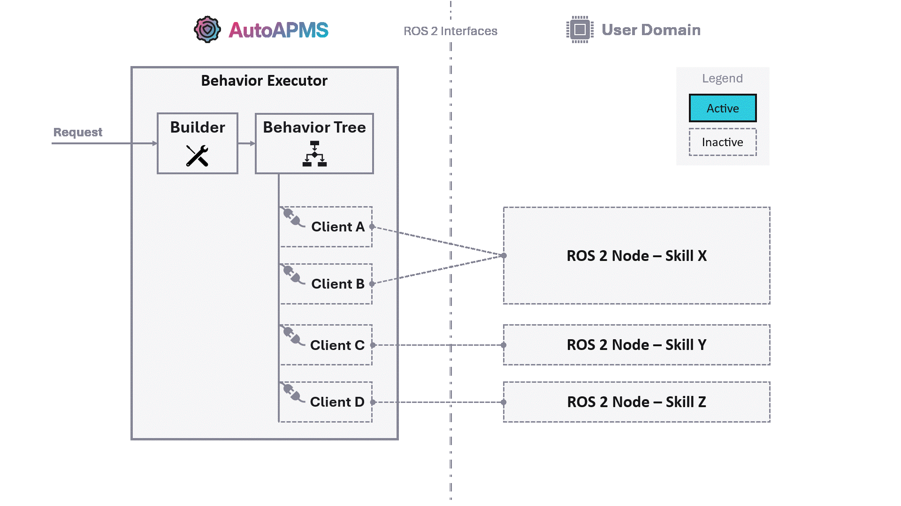

# Fundamental Workflow

Users of AutoAPMS immensely benefit from adopting a unique system architecture and flexible concepts for developing robotic applications. We advocate the following design for real-time systems:

AutoAPMS's behavior engine applies the client-server model. It's necessary that the system provides robotic skills/capabilities offering certain functions for achieving user-defined goals. We distinguish between AutoAPMS's behavior domain and the application specific user domain. It's common practice to use [ROS 2 nodes](https://docs.ros.org/en/humble/Concepts/Basic/About-Nodes.html) to implement skills within the user domain. These nodes typically incorporate [ROS 2 interfaces](https://docs.ros.org/en/humble/Concepts/Basic/About-Interfaces.html) which allows other entities to query the respective functionality. We utilize [behavior trees](./concepts/behavior-trees.md) to create clients based on the underlying interfaces and orchestrate missions.

When developing robotic applications according to the presented system architecture, the user should stick to this fundamental workflow:

1. Implement custom **behavior tree nodes** to access the skills provided by your application.

    🎓 [How to implement custom behavior tree nodes](./tutorials/implementing-behavior-tree-nodes.md)

2. Assemble those nodes by building a **behavior tree**.

    🎓 [How to build behavior trees](./tutorials/building-behavior-trees.md)

3. **Execute the behavior tree** you created to realize your application.

    🎓 [How to deploy behaviors](./tutorials/deploying-behaviors.md)

4. **Configure a mission** that defines fallback behaviors for hazardous events.

    🎓 [How to execute missions](./tutorials/executing-missions.md)

The provided tutorials demystify the complex development process and teach you how to systematically approach each of those tasks. We recommend sticking to our conventions from start to end. Ultimately, you'll be able to bring your robot to life and make it accomplish any task you want.

In case you cannot build on skills/capabilities that have already been implemented for your specific use case, you must create them yourself. See [About Implementing Skills](#about-implementing-skills) for more info.

::: tip Want a full example?
If you're just about to start and have never worked with AutoAPMS before, let us walk you through on [how to create a behavior from scratch](./tutorials/creating-a-behavior-from-scratch.md). This allows you to familiarize yourself with the fundamental workflow before you dig deeper into each individual development step.
:::

## About Implementing Skills

ROS 2 allows the user to implement [actions](https://docs.ros.org/en/humble/Concepts/Basic/About-Actions.html), [services](https://docs.ros.org/en/humble/Concepts/Basic/About-Services.html) and simple [topic](https://docs.ros.org/en/humble/Concepts/Basic/About-Topics.html) publishers or subscribers. With these concepts, robots are able to execute arbitrarily complex jobs. However, it is important to think about what a robot should be capable of and how these skills should be accessed before starting to write software. With AutoAPMS, it's crucial to have a well designed fundamental layer of execution since its higher level concepts like behavior trees and missions systematically build upon the lower level functionality. Developing the ROS 2 nodes required for your specific application is probably the most complex development task. Here are some generally applicable guidelines:

- **Keep it simple**

  It's better to have fewer nodes and interfaces. You should rather enable using actions or services in many ways, but keep it intuitive for the user.

- **Separate responsibilities**

  You should achieve a high level of modularity within your system. This means that you need to implement nodes that serve a specific purpose, but one purpose only.

- **Write reusable code**

  It's desirable to distinguish between core functionality and ROS 2 specific code. Reduce the amount of local calculation and keep your ROS 2 nodes lightweight.

AutoAPMS provides a convenient [action server wrapper](https://robin-mueller.github.io/auto-apms/classauto__apms__util_1_1ActionWrapper.html) that you may inherit from to create custom robot skills. It helps you with the troublesome process of asynchronously handling incoming requests. You simply have to overwrite the virtual methods according to the documentation. Refer to [`SimpleSkillServer`](./tutorials/creating-a-behavior-from-scratch.md#server) for an example.

Creating skills using services or topic publishers/subscribers is much simpler. We don't provide any helpers in this case. Refer to the official ROS 2 tutorials for [writing a simple service](https://docs.ros.org/en/humble/Tutorials/Beginner-Client-Libraries/Writing-A-Simple-Cpp-Service-And-Client.html#write-the-service-node) respectively [writing a simple publisher and subscriber](https://docs.ros.org/en/humble/Tutorials/Beginner-Client-Libraries/Writing-A-Simple-Cpp-Publisher-And-Subscriber.html) if you need to learn more.
