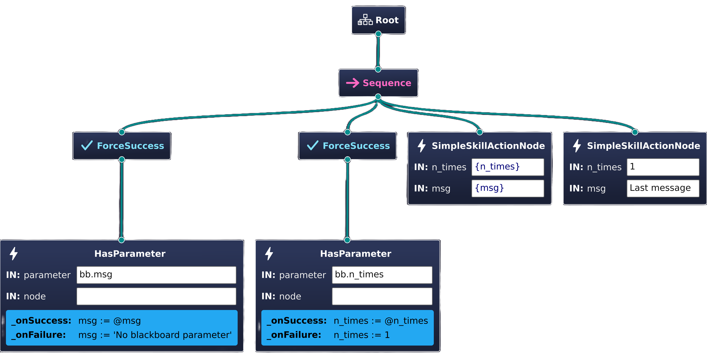

# Usage

With standard ROS 2, to enable a robot to execute a specific mission requires the user to come up with a specific design for the real-time system and develop specialized ROS 2 nodes. By adopting the flexible system architecture of AutoAPMS, the user is already provided a robust framework that helps minimizing the development effort and reduce the time to deploy your custom application. The user must consider the following topics when designing an operation:

1. Define the robot's **capabilities/skills** and corresponding interfaces for ROS 2.
2. Implement **behavior tree nodes** acting as clients to this functionality.
3. Assemble those nodes in behavior trees to represent specific **behaviors** which can be deployed using ROS 2.
4. *Optional:* Create additional behavior trees and configure a **mission** to react to problems occurring at runtime.

Navigate through the sections of this chapter to learn more about the intended workflow when developing skills, behaviors and missions for your application. In the following, we provide a simple example that shows you how the above mentioned steps can be achieved using AutoAPMS. Visit the [tutorials page](../tutorials/) for more usage examples.

## Implement a simple Skill

We're going to create a simple skill that repeatedly prints a given text to the terminal. To achieve this using AutoAPMS and ROS 2, we need to implement an action server that performs the task of writing to the terminal and a separate client that is supposed to send a message specifying the goal of the action. You could approach this development task by sticking to the [official ROS 2 tutorial for writing an action](https://docs.ros.org/en/humble/Tutorials/Intermediate/Writing-an-Action-Server-Client/Cpp.html). However, we'd like to show you a more streamlined and modular approach enabled by AutoAPMS.

::: info
In the following, we only show the most relevant source code rather than giving you in depth information about every little line of code that is necessary to build this example. The full source code for the [`simple_skill`](https://github.com/robin-mueller/auto-apms/blob/master/auto_apms_examples/src/simple_skill.cpp) example is available on GitHub.
:::

### Action Interface

To define your ROS 2 interfaces, it's common practice to create a separate package that contains `.msg`, `.service` and `.action` files for topics, services and actions respectively. We name this package `auto_apms_interfaces` and define the following interface definition file under `action/ExampleSimpleSkill.action`.

```txt
# Request
string msg
uint8 n_times 1
---
# Result
float64 time_required
---
# Feedback
```

### Server

For implementing robot skills using a ROS 2 action server, we provide the helper class [ActionWrapper](https://robin-mueller.github.io/auto-apms/classauto__apms__util_1_1ActionWrapper.html). The `SimpleSkillServer` shown below provides the functionality required by the skill we want to implement.

<<< ./simple_skill.cpp#server [simple_skill_server.cpp]

All we have to do in the CMakeLists.txt of our package is to invoke this macro provided by [`rclcpp_components`](https://github.com/ros2/rclcpp/tree/humble/rclcpp_components) (assuming you add the server's source file to a shared library called "simple_skill_server"):

::: code-group

```cmake [CMakeLists.txt (With server executable)]
# Create shared library
add_library(simple_skill_server SHARED
    "src/simple_skill_server.cpp"  # Replace with your custom path
)
ament_target_dependencies(simple_skill_server
    rclcpp_components
    auto_apms_interfaces
    auto_apms_util
)

# Register server component
rclcpp_components_register_node(simple_skill_server
    PLUGIN "my_namespace::SimpleSkillServer"
    EXECUTABLE "simple_skill_server"
)
# Allows you to simply start the server by running
# ros2 run <package_name> simple_skill_server
```

```cmake [CMakeLists.txt (Without server executable)]
# Create shared library
add_library(simple_skill_server SHARED
    "src/simple_skill_server.cpp"  # Replace with your custom path
)
ament_target_dependencies(simple_skill_server
    rclcpp_components
    auto_apms_interfaces
    auto_apms_util
)

# Register server component
rclcpp_components_register_nodes(simple_skill_server
    "my_namespace::SimpleSkillServer"
)
# No executable file is generated. You must manually do that
# or write a launch script that loads this ROS 2 node component
```

:::

### Client

Until now, we've pretty much only applied the standard ROS 2 workflow. This is about to change when we create the client for `SimpleSkillServer`. Very differently to what you're used to with ROS 2, the `SimpleSkillClient` in the following snippet does **NOT** inherit the interface of a typical `rclcpp::Node`. When using AutoAPMS, we prefer to [implement clients as behavior tree nodes](./creating-behaviors/implement-nodes). In this case, it is a [`RosActionNode`](https://robin-mueller.github.io/auto-apms/classauto__apms__behavior__tree_1_1core_1_1RosActionNode.html).

<<< ./simple_skill.cpp#client [simple_skill_client.cpp]

Just like with the server, we must also add something to the CMakeLists.txt of our package to actually make use of the `SimpleSkillClient` node. AutoAPMS provides a CMake macro that makes it easy for you to register custom nodes with the [`ament_index`](https://github.com/ament/ament_index?tab=readme-ov-file), a concept of ROS 2 that allows installing resources which can be queried at runtime. The following assumes that you add the client node's source file to a shared library called "simple_skill_nodes".

```cmake [CMakeLists.txt]
# Create shared library for the node
add_library(simple_skill_nodes SHARED
    "src/simple_skill_client.cpp"  # Replace with your custom path
)
ament_target_dependencies(simple_skill_nodes
    auto_apms_interfaces
    auto_apms_behavior_tree
)

# Declare client behavior tree node
auto_apms_behavior_tree_declare_nodes(simple_skill_nodes
    "my_namespace::SimpleSkillClient"
)
```

We use the term "declare a node" instead of "register a node" to avoid confusing this step with actually registering a node with a specific behavior tree. You will learn about the latter later when we execute our application. For now, you should note, that declaring a node works very similar to what we've done with `SimpleSkillServer`.

  Type  | C++ | CMake
--- | --- | ---
**Server** | [`RCLCPP_COMPONENTS_REGISTER_NODE`](https://docs.ros.org/en/humble/p/rclcpp_components/generated/define_register__node__macro_8hpp_1a544e598f1116a756e7440b8ce8bc5296.html#c.RCLCPP_COMPONENTS_REGISTER_NODE) | [`rclcpp_components_register_node`](https://github.com/ros2/rclcpp/blob/humble/rclcpp_components/cmake/rclcpp_components_register_node.cmake) [`rclcpp_components_register_nodes`](https://github.com/ros2/rclcpp/blob/humble/rclcpp_components/cmake/rclcpp_components_register_nodes.cmake)
**Client** | [`AUTO_APMS_BEHAVIOR_TREE_DECLARE_NODE`](https://robin-mueller.github.io/auto-apms/group__auto__apms__behavior__tree.html#ga5d6115d73fc702c19bd6d63860dc2131) | [`auto_apms_behavior_tree_declare_nodes`](https://github.com/robin-mueller/auto-apms/blob/master/auto_apms_behavior_tree_core/cmake/declare_nodes.cmake)

## Build a Behavior Tree

With both server and client implemented, we are done writing the low-level source code and ready to climb up the ladder of abstraction: We may now build our first behavior tree and actually employ the functionality we've just created!

### Configure a Node Manifest

As you know, behavior trees are composed of nodes. Within AutoAPMS, **all behavior tree nodes are plugins** (except for the builtin/native nodes statically implemented by BehaviorTree.CPP). They are loaded at runtime when the tree is created. To specify which node classes to load and how to instantiate them, you must configure so called **node manifests**. To reproduce this example, you don't need to know the details about this concept. Nevertheless, feel encouraged to check out the designated chapter on [how to configure node manifests](./creating-behaviors/implement-nodes#configure-a-node-manifest).

The node manifest for the behavior tree we're going to build looks like this:

```yaml [simple_skill_node_manifest.yaml]
SimpleSkillActionNode:
  class_name: auto_apms_examples::SimpleSkillClient
  port: simple_skill

HasParameter:
  class_name: auto_apms_behavior_tree::HasParameter
  port: (input:node)/list_parameters
```

We want to include two custom nodes in our behavior tree:

- **SimpleSkillActionNode**

  This is the node that acts as a client to the `simple_skill` action we implemented above. As mentioned before, we need to include this node to send the action goal to the server.

- **HasParameter**

  We additionally want to incorporate a node that allows us to determine if the tree executor defines a certain ROS 2 parameter, because want to support dynamically setting the message to be printed. This node is one of many [standard nodes](./creating-behaviors/implement-nodes#standard-nodes-reference) provided by the package `auto_apms_behavior_tree`.

Before we're able to build our behavior tree, we must make sure that our node manifest will be available at runtime. This is achieved by registering one more `ament_index` resource using the `NODE_MANIFEST` argument accepted by the CMake macros `auto_apms_behavior_tree_declare_nodes` and `auto_apms_behavior_tree_declare_trees`. Visit the designated chapter towards [node manifest resources](./creating-behaviors//implement-nodes#about-node-manifest-resources) to learn more about the different possibilities to create one. We've already used the former macro when declaring our client node. The latter is intended for - you've guessed it - registering yet another resource: The actual behavior tree source file. It's pretty obvious that the resource system of ROS 2 is invaluable for AutoAPMS.

You must modify the CMakeLists.txt of your package according to how you intend to create the behavior tree. We distinguish between two general approaches: You may either create a behavior tree [**graphically**](#graphical-approach) using a suitable visual editor or [**programmatically**](#programmatic-approach) by incorporating the C++ API offered by AutoAPMS. The following shows the required configuration for being able to successfully build the example:

::: code-group

```cmake [CMakeLists.txt (Graphical approach)]
# Create shared library for the node
add_library(simple_skill_nodes SHARED
    "src/simple_skill_client.cpp"  # Replace with your custom path
)
ament_target_dependencies(simple_skill_nodes
    auto_apms_interfaces
    auto_apms_behavior_tree
)

# Declare client behavior tree node
auto_apms_behavior_tree_declare_nodes(simple_skill_nodes
    "my_namespace::SimpleSkillClient"
)

# Declare simple skill tree
auto_apms_behavior_tree_declare_trees(
    "config/simple_skill_tree.xml"  # Replace with your custom path
    NODE_MANIFEST
    "config/simple_skill_node_manifest.yaml"  # Replace with your custom path
)

# The plugin libraries MUST be installed manually
install(
    TARGETS
    simple_skill_nodes
    LIBRARY DESTINATION lib
    ARCHIVE DESTINATION lib
    RUNTIME DESTINATION bin
)
```

```cmake [CMakeLists.txt (Programmatic approach)]
# Create shared library for the node
add_library(simple_skill_nodes SHARED
    "src/simple_skill_client.cpp"  # Replace with your custom path
)
ament_target_dependencies(simple_skill_nodes
    auto_apms_interfaces
    auto_apms_behavior_tree
)

# Create another shared library for the build handler
add_library(simple_skill_build_handler SHARED
    "src/simple_skill_build_handler.cpp"  # Replace with your custom path
)
ament_target_dependencies(simple_skill_build_handler
    auto_apms_behavior_tree
)

# Declare client behavior tree node
auto_apms_behavior_tree_declare_nodes(simple_skill_nodes
    "my_namespace::SimpleSkillClient"
    NODE_MANIFEST
    "config/simple_skill_node_manifest.yaml"  # Replace with your custom path
    NODE_MODEL_HEADER_TARGET  # Optional: Generate C++ code for custom nodes
    simple_skill_build_handler
)

# We don't need to call auto_apms_behavior_tree_declare_trees in this example
# Instead, we implement a behavior tree build handler plugin

# Declare the behavior tree build handler that builds the simple skill tree
auto_apms_behavior_tree_declare_build_handlers(simple_skill_build_handler
    "my_namespace::SimpleSkillBuildHandler"
)

# The plugin libraries MUST be installed manually
install(
    TARGETS
    simple_skill_nodes
    simple_skill_build_handler
    LIBRARY DESTINATION lib
    ARCHIVE DESTINATION lib
    RUNTIME DESTINATION bin
)
```

:::

With the CMakeLists.txt for the programmatic approach we jumped ahead a little, because we haven't introduced the third CMake macro `auto_apms_behavior_tree_declare_build_handlers`. This fundamentally works like `rclcpp_components_register_nodes`, but it's designed specifically for registering/declaring [behavior tree build handlers](./creating-behaviors/build-trees#using-treebuildhandler). You'll learn more about what a build handler is and how to implement it in the section about programmatically building a behavior tree.

Now we're finally able to configure a behavior tree that employs the functionality provided by our simple skill.

### Graphical Approach

Behavior trees are defined using the XML format. So to define a behavior incorporating our simple skill, we must create a new `.xml` file from scratch. You can do that manually or run this convenient command that automatically writes an empty behavior tree to the given file.

```bash [Terminal]
ros2 run auto_apms_behavior_tree new_tree "config/simple_skill_tree.xml"
```

::: tip
Also consider using the corresponding [VSCode Task](https://code.visualstudio.com/Docs/editor/tasks) which does the same thing.

➡️ `Terminal -> Run Task... -> Write empty behavior tree`

You must manually create an empty `.xml` file and open it before executing the task, since the current opened file will be used.
:::

No matter how or where you create the behavior tree file, you'll probably need a visual editor for behavior trees. We recommend [Groot2](https://www.behaviortree.dev/groot/), because it's designed to be compatible with the behavior tree XML schema used by AutoAPMS and considered the de facto standard.

Once you launched Groot2, you need open/create your behavior tree file. Groot2 allows to build behavior trees by dragging and dropping node icons. However, you must explicitly tell the application how your custom nodes are called, which type they have and what data ports they implement. This is what **behavior tree node model files** are used for. These files hold information about custom nodes that you want to use in Groot2 for creating a specific behavior. When using AutoAPMS, they are automatically generated by CMake when registering node manifests and must manually be loaded using the "Import models from file" button. The model XML files are installed under `auto_apms/auto_apms_behavior_tree_core/metadata/node_model_<metadata_id>.xml` relative to the share directory of the respective package. For more information, refer to the detailed instructions on [how to use Groot2](./creating-behaviors/build-trees#using-groot2).

The graphical approach allows the user to quickly and intuitively configure the XML for the behavior tree. We define the behavior according to these rules:

1. If a custom message was specified using a parameter, use this. Otherwise, use a default message.

1. If a custom number of prints to the terminal was specified using a parameter, use this. Otherwise, only print once.

1. After both variables have been determined, execute the `simple_skill` action with the corresponding goal.

1. To indicate that the behavior is finished, print a final message once.

#### Example Behavior Tree



```xml [simple_skill_tree.xml]
<?xml version="1.0" encoding="UTF-8"?>
<root BTCPP_format="4"
      main_tree_to_execute="SimpleSkillDemo">
  <BehaviorTree ID="SimpleSkillDemo">
    <Sequence>
      <ForceSuccess>
        <HasParameter parameter="bb.msg"
                      node=""
                      _onSuccess="msg := @msg"
                      _onFailure="msg := &apos;No blackboard parameter&apos;"/>
      </ForceSuccess>
      <ForceSuccess>
        <HasParameter parameter="bb.n_times"
                      node=""
                      _onSuccess="n_times := @n_times"
                      _onFailure="n_times := 1"/>
      </ForceSuccess>
      <SimpleSkillActionNode n_times="{n_times}"
                             msg="{msg}"/>
      <SimpleSkillActionNode n_times="1"
                             msg="Last message"/>
    </Sequence>
  </BehaviorTree>
</root>

```

::: tip What are Global Blackboard Parameters?

This example behavior tree showcases a very useful concept introduced by AutoAPMS: **Global Blackboard Parameters**. They are accessed using the `bb.`/`@` prefix and allow us to adjust the behavior without rebuilding the entire tree, thus makes it reusable. This concept fuses [ROS 2 Parameters](https://docs.ros.org/en/humble/Concepts/Basic/About-Parameters.html) with the [Global Blackboard Idiom](https://www.behaviortree.dev/docs/tutorial-advanced/tutorial_16_global_blackboard). This is one of the reasons why AutoAPMS's adaption of the behavior tree paradigm is very well integrated with ROS 2.

Refer to the designated chapter [about global blackboard parameters](./deploying-behaviors/global-blackboard) for more information.

:::

This behavior tree would theoretically be ready for deployment, but first we want to show you an alternative approach of building this tree.

### Programmatic Approach

To allow building behavior trees programmatically, we offer a powerful C++ API. The required functionality is provided by the following two classes:

- [`TreeDocument`](https://robin-mueller.github.io/auto-apms/classauto__apms__behavior__tree_1_1core_1_1TreeDocument.html)

  Implements a [Document Object Model (DOM)](https://de.wikipedia.org/wiki/Document_Object_Model) for the [behavior tree XML schema](https://www.behaviortree.dev/docs/learn-the-basics/xml_format). It offers a modular, streamlined API to create and modify the XML representation of behavior trees within ROS 2 workspaces.

- [`TreeBuildHandler`](https://robin-mueller.github.io/auto-apms/classauto__apms__behavior__tree_1_1TreeBuildHandler.html)

  Introduces a plugin-based approach for implementing specialized algorithms for building behavior trees. When [deploying behaviors](./deploying-behaviors/), users may dynamically load plugins created by inheriting from this class for customizing how [`TreeExecutorNode`](https://robin-mueller.github.io/auto-apms/classauto__apms__behavior__tree_1_1TreeExecutorNode.html) builds the behavior tree to be executed.

We're going to show you how to use this functionality by implementing a custom **behavior tree build handler** that builds the tree shown above. Refer to the designated chapter about [building behavior trees using build handlers](./creating-behaviors/build-trees#using-treebuildhandler) for a full guide on that topic.

We highly recommend [incorporating node models](./creating-behaviors/build-trees#incorporate-node-models) when using `TreeDocument`. This makes the source code more verbose and enables detecting behavior tree syntax errors at compile time. This is why we added these lines

```cmake [CMakeLists.txt (Programmatic approach)]
auto_apms_behavior_tree_declare_nodes(simple_skill_nodes
    "my_namespace::SimpleSkillClient"
    NODE_MANIFEST
    "config/simple_skill_node_manifest.yaml"  # Replace with your custom path
    NODE_MODEL_HEADER_TARGET  # Optional: Generate C++ code for custom nodes [!code ++:2]
    simple_skill_build_handler
)
```

to the CMake macro that parses our node manifest and registers a corresponding resource. Specifying the `NODE_MODEL_HEADER_TARGET` argument additionally allows us to include an automatically generated C++ header which contains specific classes that represent our custom nodes. They are intended to be used as template arguments when building the tree.

#### Example Build Handler

<<< ./simple_skill.cpp#build_handler [simple_skill_build_handler.cpp]

Congratulations! 🎉 You are now familiar with the general workflow of creating behaviors.

## Execute the Behavior Tree

Finally, we're going to demonstrate how our simple skill and the behavior tree we've just created can be deployed. Make sure that you [build and install AutoAPMS](../installation/) and your custom package which contains the source code for the example described above (we called it `my_package` before).

```bash [Terminal]
colcon build --packages-up-to my_package --symlink-install
```

The package `auto_apms_behavior_tree` offers an executable called `run_tree` which may be used to execute a specific behavior tree. It provides a runtime for AutoAPMS's flexible [`TreeExecutorNode`](https://robin-mueller.github.io/auto-apms/classauto__apms__behavior__tree_1_1TreeExecutorNode.html). You may either use this executable by running it from a terminal

```bash [Terminal]
ros2 run auto_apms_behavior_tree run_tree -h  # Prints help information
```

or by including it inside a [ROS 2 launch file](https://docs.ros.org/en/humble/Tutorials/Intermediate/Launch/Creating-Launch-Files.html).

```py [launch.py]
from launch import LaunchDescription
from launch_ros.actions import Node

def generate_launch_description():
    return LaunchDescription(
        [
            Node(
                package="auto_apms_behavior_tree",
                executable="run_tree",
                arguments=["-h"]  # Prints help information
            )
        ]
    )
```

It accepts one argument: The build request for the underlying [behavior tree build handler](./creating-behaviors/build-trees#using-treebuildhandler). By default, you can simply specify a [behavior tree resource](./creating-behaviors/about-tree-resources) and the corresponding behavior tree will be executed immediately. If you want to know more about the usage of `run_tree` and alternative ways to execute a behavior tree, visit the chapter about [deploying behaviors](./deploying-behaviors/).

To run the simple skill example, execute the following steps:

::: tabs

== Graphical approach
If you decided to create a behavior tree XML file using Groot2 (theoretically you could also do so manually), your behavior tree should be declared using the CMake macro `auto_apms_behavior_tree_declare_trees`. A behavior tree declared like this can automatically be discovered at runtime. The macro installs a [behavior tree resource](./creating-behaviors/about-tree-resources) and enables the `TreeFromResourceBuildHandler` which comes with AutoAPMS to read the corresponding XML file and build the tree. By default, `TreeExecutorNode` loads this build handler when it is started. This conveniently allows us to execute any declared behavior tree like this:

```bash [Terminal]
ros2 run auto_apms_behavior_tree run_tree "<package_name>::<tree_file_stem>::<tree_name>"
```

> [!TIP]
> Also consider using the corresponding [VSCode Task](https://code.visualstudio.com/Docs/editor/tasks) which does the same thing.
>
> ➡️ `Terminal -> Run Task... -> Run behavior tree`

<h3>Run the Example (Graphical approach)</h3>

Let us demonstrate the intended usage of `run_tree` for the behavior tree we created applying the **graphical approach**. AutoAPMS provides [`SimpleSkillServer`](#server), [`SimpleSkillClient`](#client) and the example tree called [`SimpleSkillDemo`](#example-behavior-tree) with the package `auto_apms_examples`. Other than executing the tree, you must of course make sure that the server providing our simple skill is started as well.

<h4>Using only the terminal</h4>

Start the simple skill server in its own terminal:

```bash [Terminal]
ros2 run auto_apms_examples simple_skill_server
```

Afterwards, create a new terminal and start executing the behavior tree:

```bash [Terminal]
ros2 run auto_apms_behavior_tree run_tree auto_apms_examples::simple_skill_tree::SimpleSkillDemo
```

<h4>Using a launch file</h4>

Or you do both in a single [launch file](https://docs.ros.org/en/humble/Tutorials/Intermediate/Launch/Launch-Main.html) similar to this:

```py [simple_skill_launch.py]
from launch import LaunchDescription
from launch_ros.actions import Node

def generate_launch_description():
    return LaunchDescription(
        [
            # Spawn the simple skill server
            Node(
                package="auto_apms_examples",
                executable="simple_skill_server"
            ),
            # Spawn the behavior tree executor for the simple skill tree
            Node(
                package="auto_apms_behavior_tree",
                executable="run_tree",
                arguments=["auto_apms_examples::simple_skill_tree::SimpleSkillDemo"]
            )
        ]
    )
```

```bash [Terminal]
ros2 launch auto_apms_examples simple_skill_launch.py approach:=graphical
```

<h4>Modify the behavior using parameters</h4>

Remember that we configured the behavior tree so that we can adjust the behavior according to the parameters `bb.msg` and `bb.n_times`? They can be specified like any other ROS 2 parameter by either using [the command line](https://docs.ros.org/en/humble/How-To-Guides/Node-arguments.html#passing-ros-arguments-to-nodes-via-the-command-line) or [a launch file](https://docs.ros.org/en/humble/How-To-Guides/Launch-file-different-formats.html#). For example, run this:

```bash [Terminal]
ros2 run auto_apms_behavior_tree run_tree auto_apms_examples::simple_skill_tree::SimpleSkillDemo --ros-args -p bb.msg:="Custom message" -p bb.n_times:=10
```

Or add the parameters inside the launch file:

```py [simple_skill_launch.py]
from launch import LaunchDescription
from launch_ros.actions import Node

def generate_launch_description():
    return LaunchDescription(
        [
            # Spawn the simple skill server
            Node(
                package="auto_apms_examples",
                executable="simple_skill_server"
            ),
            # Spawn the behavior tree executor for the simple skill tree
            Node(
                package="auto_apms_behavior_tree",
                executable="run_tree",
                arguments=["auto_apms_examples::simple_skill_tree::SimpleSkillDemo"],
                parameters=[{"bb.msg": "Custom message", "bb.n_times": 10}]  # [!code ++]
            )
        ]
    )
```

Try out different parameters yourself!

== Programmatic approach
If you decided to use the `TreeBuildHandler` concept and implemented a custom plugin which builds your behavior tree, there is no XML file that you can refer to when you want to execute your behavior. Instead, you must provide the class name of the corresponding build handler to `TreeExecutorNode`. This is achieved by setting a parameter named `build_handler`. When this parameter is set, the tree executor loads the given build handler plugin which allows the behavior tree to be built according to the underlying algorithm.

The user can set the `build_handler` parameter for `TreeExecutorNode` like any other ROS 2 parameter by either using [the command line](https://docs.ros.org/en/humble/How-To-Guides/Node-arguments.html#passing-ros-arguments-to-nodes-via-the-command-line) or [a launch file](https://docs.ros.org/en/humble/How-To-Guides/Launch-file-different-formats.html#).

### Run the Example (Programmatic approach)

Let us demonstrate the intended usage of `run_tree` for the behavior tree we created applying the **programmatic approach**. AutoAPMS provides [`SimpleSkillServer`](#server), [`SimpleSkillClient`](#client) and the example build handler called [`SimpleSkillBuildHandler`](#example-build-handler) with the package `auto_apms_examples`. Other than executing the tree, you must of course make sure that the server providing our simple skill is started as well.

<h4>Using only the terminal</h4>

Start the simple skill server in its own terminal:

```bash [Terminal]
ros2 run auto_apms_examples simple_skill_server
```

Afterwards, create a new terminal and start executing the behavior tree:

```bash [Terminal]
ros2 run auto_apms_behavior_tree run_tree --ros-args -p build_handler:=auto_apms_examples::SimpleSkillBuildHandler
```

<h4>Using a launch file</h4>

Or you do both in a single [launch file](https://docs.ros.org/en/humble/Tutorials/Intermediate/Launch/Launch-Main.html) similar to this:

```py [simple_skill_launch.py]
from launch import LaunchDescription
from launch_ros.actions import Node

def generate_launch_description():
    return LaunchDescription(
        [
            # Spawn the simple skill server
            Node(
                package="auto_apms_examples",
                executable="simple_skill_server"
            ),
            # Spawn the behavior tree executor for the simple skill tree
            Node(
                package="auto_apms_behavior_tree",
                executable="run_tree",
                parameters=[
                    {
                        "build_handler": "auto_apms_examples::SimpleSkillBuildHandler"
                    }
                ]
            )
        ]
    )
```

```bash [Terminal]
ros2 launch auto_apms_examples simple_skill_launch.py approach:=programmatic
```

<h4>Modify the behavior using parameters</h4>

Remember that we configured the behavior tree so that we can adjust the behavior according to the parameters `bb.msg` and `bb.n_times`? They can be specified just like we did with `build_handler`. For example, run this:

```bash [Terminal]
ros2 run auto_apms_behavior_tree run_tree --ros-args -p build_handler:=auto_apms_examples::SimpleSkillBuildHandler -p bb.msg:="Custom message" -p bb.n_times:=10
```

Or add the parameters inside the launch file:

```py [simple_skill_launch.py]
from launch import LaunchDescription
from launch_ros.actions import Node

def generate_launch_description():
    return LaunchDescription(
        [
            # Spawn the simple skill server
            Node(
                package="auto_apms_examples",
                executable="simple_skill_server"
            ),
            # Spawn the behavior tree executor for the simple skill tree
            Node(
                package="auto_apms_behavior_tree",
                executable="run_tree",
                parameters=[
                    {
                        "build_handler": "auto_apms_examples::SimpleSkillBuildHandler",
                        "bb.msg": "Custom message",  # [!code ++]
                        "bb.n_times": 10  # [!code ++]
                    }
                ]
            )
        ]
    )
```

Try out different parameters yourself!

:::
